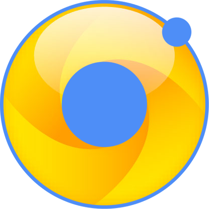

# ionic-wikitude-module

AngularJS module for using the Wikitude cordova plugin in an Ionic project.

# Disclaimer

This project is still under development and should not be used... for now ;)

============


# Ionicitude

AngularJS module for using the Wikitude cordova plugin in an Ionic project.

## Introduction
This bower package is designed for Ionic developers that wants to use the [cordova Wikitude plugin](http://www.wikitude.com/products/extensions/cordova-plugin-augmented-reality/) to add Augmented Reality (AR) in their app. It provides an Angular Service, named Ionicitude, with a simple API to interact with the cordova plugin, wether it be setting, launching or handling request (more about that later).

### Important note:
:warning: **The cordova Wikitude plugin relies heavily on the device's hardware and software (camera, accelerometer, compass, etc). Thus, you won't be able to test it anywhere except on a real device. Testing in a browser or an emulator will both fail.**

## Installing the Cordova Wikitude plugin
**This package DOES NOT come along with the cordova Wikitude plugin !**

Since Ionicitude is a service to use the cordova Wikitude plugin, you'll need to first install the plugin on your project, with the following command (that can take a while: it's a heavy plugin):

`ionic plugin add https://github.com/Wikitude/wikitude-cordova-plugin.git`
### Wikitude Licence Key
To use the Wikitude plugin, you have to have a valid licence key. You can obtain one by registering on the Wikitude site, logging in, and accessing the [licence key management page](http://www.wikitude.com/developer/licenses). Here, you can download a free trial licence key for the Wikitude SDK.

The downloaded file is juste a plain text file containing your licence key.

Copy it, go to the `WikitudePlugin.js` file (located at `plugins/com.wikitude.phonegap.WikitudePlugin/www/WikitudePlugin.js`) and paste it as the value to `this._sdkKey` on line 11.

_Note : If you already installed any platform to your project, you'll need to install them again for the plugin modification to propagate (see next point for android platform)._

### Android platform version ^5.0.0
If you want your Ionic app to build correctly for android, with the cordova Wikitude plugin installed, it's absolutely imperative that you add the android platform with at least its `5.0.0` version. Otherwise your build will fail.

If you haven't added the android platform to your project yet, you can do it with:

`ionic platform add android@5.0.0`

If you already added the android platform to your project, please check it's version with this command:

`ionic platform`

If it's lower than `5.0.0`, you will have to update it:

`ionic platform update android@5.0.0`

When it's done, you can check that everything's OK by typing this commande (and crossing your fingers):

`ionic build android`

### Known bugs

Please, be advised that there are actually some akwards bugs on Android regarding the back button handling from within an AR View, and the user location tracking lifecycle. If you encouter them, please do not raise an issue here but go either on the [Github Wikitude repo](http://github.com/Wikitude/wikitude-cordova-plugin/issues) or on the [Wikitude Developer Forum](http://www.wikitude.com/developer/developer-forum) (you'll need to register).

## Installing Ionicitude
OK ! Now that we have successfully installed the cordova Wikitude plugin (right?), let's use it with Ionicitude. To install Ionicitude, you have two choices.

### With `ionic add`

_Note : this is just syntactic sugar for `bower install`_

From within you app's directory, type:

`ionic add tazaf/ionicitude`

The package will be installed in the `www/lib/ionicitude`.

You will need to add the following line in your app's `index.html`, after the calls to `ionic.bundle.js` and `cordova.js` :

```html
<script src="lib/ionicitude/dist/ionicitude.min.js"></script>
```

Or, if you want the readable version :

```html
<script src="lib/ionicitude/dist/ionicitude.js"></script>
```

### Manually

You can also simply download this project on your computer, place it wherever you like in your project. Then, locate either the `ionicitude.js` file or the `ionicitude.min.js` file, both being in the `dist` folder of the project, and include them in your app's `index.html`, after the calls to `ionic.bundle.js` and `cordova.js` :

```html
<script src="path/to/the/file/ionicitude.min.js"></script>
```
_Note: you'll obviously need to replace `path/to/the/file` with the actual path to the file._

### Registering the dependency
Whatever install method you choose, you'll finally have to register the module in your app's dependencies:

```javascript
// In app.js or wherever you created your app's module
angular.module('app', ['ionic', 'Ionicitude', 'other dependencies']);
```
## Initialization

Ionicitude needs to actually load the cordova Wikitude plugin to properly function. There's a method for this.
It needs to be called prior to ANY use of the module and it needs to be called when the device is ready.
